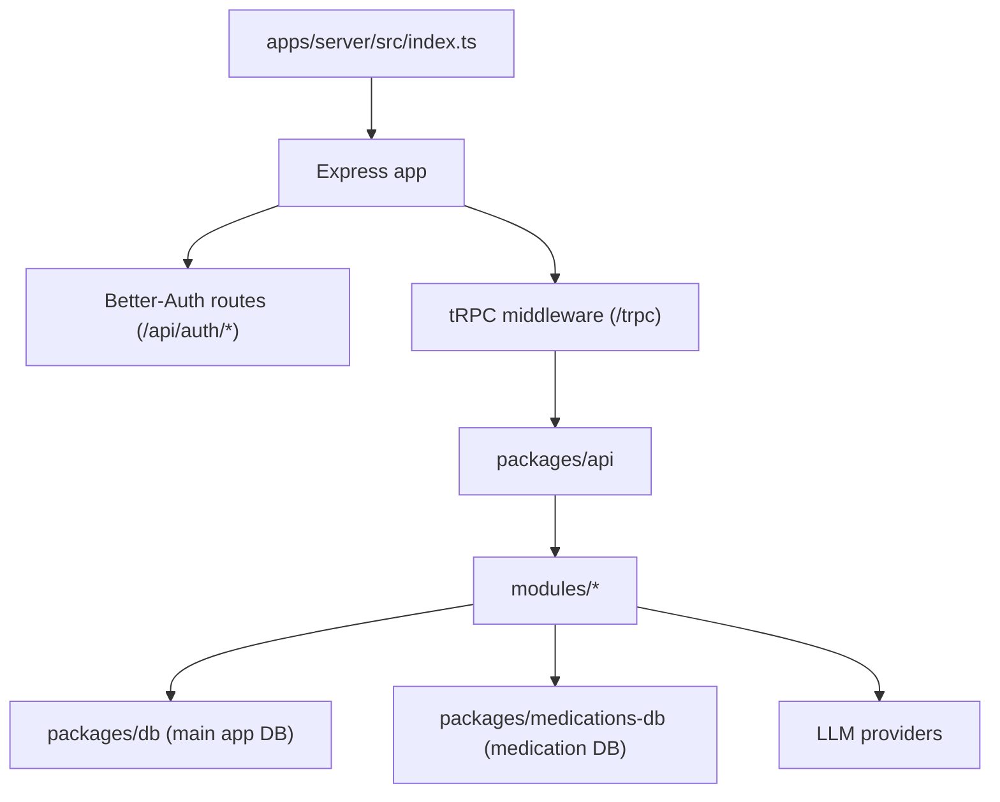
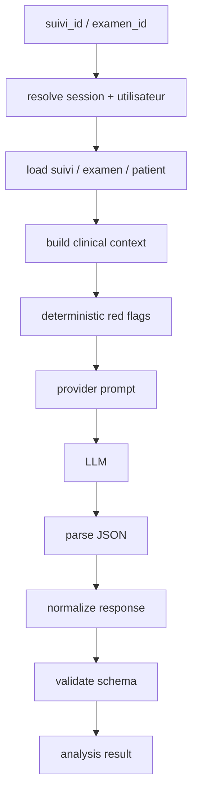
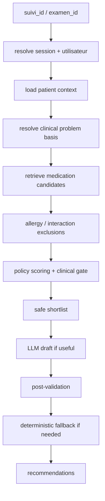
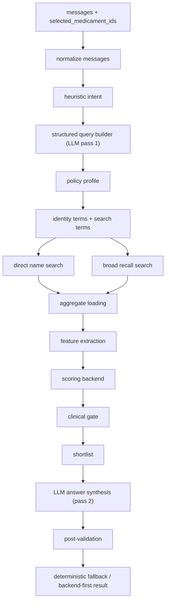

# AGENT CONTEXT - doctor.com

Ce document est un contexte de reprise pour un futur agent AI ou un nouveau
coequipier. Il vise a rendre le repo comprehensible sans dependre de
l'historique complet des conversations precedentes.

Il decrit:

- l'architecture generale du monorepo
- les applications et packages
- le fonctionnement backend
- les deux bases de donnees
- l'authentification
- la structure tRPC
- les modules metier
- les agents AI
- l'etat actuel du projet
- les commandes utiles
- les conventions a respecter

Ce document doit etre traite comme une base de contexte stable. Il ne remplace
pas le code, mais il permet de retrouver rapidement la logique d'ensemble.


## 1. Vue d'ensemble

`doctor.com` est un monorepo Bun + Turborepo pour une application de gestion
de cabinet medical.

Stack principale:

- Bun
- TypeScript
- Express
- tRPC
- Drizzle ORM
- PostgreSQL
- Better-Auth
- TanStack Router cote web
- Google GenAI / providers LLM multiples cote backend

Le repo est organise autour d'une separation forte:

- `apps/*` = runtimes et clients
- `packages/*` = logique partagee et metier


## 1.1. Explication produit, plateforme et logique du projet

Ce projet ne doit pas etre lu uniquement comme "une API medicale" ou "une app
CRUD". La logique generale est plus proche d'un systeme d'exploitation de
cabinet medical, avec le patient comme centre de gravite.

L'idee produit est simple:

- un medecin ne travaille pas par tables de base de donnees
- il travaille par moments cliniques
- il veut passer rapidement du rendez-vous au dossier, du dossier a la
  consultation, de la consultation a l'examen, puis a l'ordonnance, au
  document ou au suivi

Le projet cherche donc a structurer la plateforme autour du vrai parcours de
travail du medecin, pas autour d'un empilement technique.


### 1.1.1. Probleme que la plateforme cherche a resoudre

Dans un cabinet, l'information utile est souvent dispersee:

- agenda et rendez-vous d'un cote
- dossier administratif du patient d'un autre
- antecedents et traitements ailleurs
- consultation actuelle dans un autre ecran
- documents, ordonnances et examens encore ailleurs
- et, en plus, la recherche medicamenteuse prend du temps

Le cout reel de cette fragmentation n'est pas seulement technique:

- perte de temps pendant la consultation
- charge mentale elevee pour le medecin
- risque d'oublier une information importante
- repetition d'informations deja connues
- difficulte a garder une vision clinique coherente dans le temps

La plateforme essaie donc de reconstruire une experience plus fluide:

- voir le bon patient au bon moment
- retrouver rapidement son contexte medical
- produire les bons objets cliniques
- garder une trace exploitable dans le temps


### 1.1.2. Coeur conceptuel du produit

Le coeur du produit est le couple:

- `patient`
- `suivi / consultation`

Le patient represente la personne et son contexte longitudinal.

Le suivi represente un episode ou une consultation dans le temps. C'est la
vraie unite de travail clinique. Autour du suivi viennent se greffer:

- le motif
- l'examen
- l'hypothese diagnostique
- le traitement ou l'ordonnance
- les documents
- l'historique exploitable

Autrement dit:

- le patient = la memoire longue
- le suivi = l'action clinique du moment


### 1.1.3. Logique fonctionnelle des grands modules

Chaque module sert une etape concrete du travail medical.

#### Agenda / RDV

Le module agenda sert de point d'entree operationnel.

Il repond a la question:
"Qui vient, quand, et quel est le prochain patient a prendre en charge ?"

Son role n'est pas juste d'afficher un calendrier. Il alimente le passage vers
le dossier patient et la consultation.

#### Patient / dossier medical

La fiche patient sert de socle longitudinal.

On y retrouve ce qui ne doit pas etre repense a chaque consultation:

- identite
- contexte de base
- antecedents
- allergies ou signaux associes
- traitements
- historique
- vaccinations
- voyages
- documents

Le but est d'eviter qu'un medecin reparte de zero a chaque fois.

#### Consultation / suivi / examen

C'est le coeur metier quotidien.

Le suivi capture:

- pourquoi le patient consulte
- ce qui est observe
- ce qui est pense cliniquement
- ce qui est decide

L'examen est la matiere clinique immediate. Il structure le present. Le suivi
relie ce present a l'historique.

#### Medicaments

Le module medicaments n'est pas un simple catalogue. Il joue le role de base
de connaissance therapeutique locale.

Il doit aider a:

- retrouver rapidement un medicament
- comprendre ce qu'il contient
- voir indications, precautions, contre-indications et interactions
- preparer une decision therapeutique plus vite

#### Ordonnances et documents

Ces modules sont les sorties concretes de la consultation.

Ils servent a transformer une reflexion clinique en objet utile:

- ordonnance
- document
- trace ecrite

Le projet cherche a faire en sorte que ces sorties reutilisent le contexte deja
present, plutot que d'obliger le medecin a ressaisir encore la meme chose.


### 1.1.4. Pourquoi il y a une base principale et une base medicaments

Le projet a une logique de separation fonctionnelle forte:

- la base principale contient la vie du cabinet et du patient
- la base medicaments contient la connaissance therapeutique

Cette separation a du sens produit:

- les donnees patient sont dynamiques, sensibles et propres au cabinet
- les donnees medicaments ressemblent a un referentiel / corpus externe

Donc:

- on ne melange pas le dossier du patient avec le catalogue medicamenteux
- on croise ces deux mondes seulement quand c'est necessaire

Par exemple:

- `medicationAssistant` travaille surtout sur la base medicaments
- `ordonnanceRecommendation` croise dossier patient + consultation +
  base medicaments


### 1.1.5. Philosophie AI du projet

L'AI dans ce repo n'est pas pensee comme un "medecin automatique". C'est un
choix tres important.

La logique generale est:

- l'AI aide
- le backend filtre
- le medecin decide

L'AI est donc utilisee pour accelerer ou clarifier, pas pour remplacer le
jugement clinique.

Dans ce projet, les modules AI ont chacun un role bien distinct:

#### `hypotheseDiagnostic`

But:

- aider au raisonnement clinique
- faire emerger des hypotheses
- signaler des red flags
- resumer ce qu'il manque encore

Ce module est plus proche d'un assistant de raisonnement.

#### `medicationAssistant`

But:

- aider a chercher dans le catalogue medicaments
- resumer ou comparer
- faire gagner du temps dans une base complexe

Ce module est plus proche d'un assistant d'exploration therapeutique.

#### `ordonnanceRecommendation`

But:

- aider a preparer un brouillon d'ordonnance
- proposer des options candidates
- encadrer la decision par des garde-fous

Ce module n'est pas un moteur de prescription autonome. C'est un assistant de
preparation.


### 1.1.6. Positionnement securite et responsabilite

Le projet suit implicitement une logique de securite tres importante:

- le medecin reste responsable
- les sorties AI sont des aides
- la decision finale n'est jamais deleguee au modele

Cela explique plusieurs choix d'architecture:

- validation stricte des schemas de sortie
- refus ou degradation propre quand la sortie LLM est mauvaise
- filtrage backend avant la generation finale
- refus des cas qui necessitent un contexte patient absent
- disclaimers explicites sur les routes AI

Autrement dit:

- mieux vaut une reponse vide qu'une reponse cliniquement aventureuse
- mieux vaut un fallback conservateur qu'une hallucination persuasive


### 1.1.7. Logique d'interface implicite

Meme si le repo est technique, il porte deja une logique d'interface assez
claire.

#### Page globale medicaments

Elle est faite pour:

- explorer
- chercher
- comparer
- naviguer vite dans le catalogue

Donc l'agent le plus naturel ici est un assistant global de type chat,
stateless, sans contexte patient.

#### Page detail medicament

Elle sert surtout a lire et comprendre un produit donne.

Ici, un resume intelligent integre a la fiche est plus logique qu'un gros agent
conversationnel autonome.

#### Page patient / consultation

C'est l'endroit ou le contexte clinique existe vraiment.

Donc les fonctions comme:

- "est-ce adapte a ce patient ?"
- "quelle ordonnance proposer ?"

doivent vivre ici, pas dans un chat global medicaments.


### 1.1.8. Objectif concret du projet

Si on retire toute la technique, le projet cherche surtout a obtenir ceci:

- moins de navigation inutile
- moins de ressaisie
- moins de recherche manuelle dispersive
- plus de continuite clinique
- plus de vitesse sans perdre en prudence

En une phrase:

`doctor.com` essaie de transformer un ensemble de taches medicales eparses en
un parcours de travail continu, structure et assiste.

Ce point est important pour tout futur agent ou developpeur:

- quand une decision technique est ambigue, il faut privilegier ce qui aide le
  medecin a aller plus vite sans perdre le contexte ni la securite
- quand un module devient "intelligent", il doit rester au service du flux de
  travail clinique, pas le compliquer


## 2. Monorepo map

### 2.1. Apps

- `apps/server`
  runtime Express
  monte Better-Auth et tRPC
  contient le point d'entree serveur, pas la logique metier

- `apps/web`
  client web
  consomme le backend

- `apps/native`
  client mobile / Expo


### 2.2. Packages

- `packages/api`
  coeur backend metier
  modules tRPC
  services, repos, routeurs
  agents AI

- `packages/db`
  base principale application
  schema Drizzle
  migrations
  client PostgreSQL principal

- `packages/medications-db`
  base PostgreSQL dediee aux medicaments
  utilisee comme source de verite medicamentaire

- `packages/auth`
  configuration Better-Auth

- `packages/env`
  validation des variables d'environnement

- `packages/shared`
  schemas Zod et types partages

- `packages/config`
  configuration TypeScript / outils


## 3. Runtime global

Le runtime de production / dev backend passe par `apps/server`.

Flux:



Point d'entree principal:

- `apps/server/src/index.ts`

Backend API root:

- `packages/api/src/trpc/router.ts`


## 4. Package manager, build et orchestration

### 4.1. Package manager

- `bun@1.2.20`

### 4.2. Orchestration

- `turbo.json`

### 4.3. Scripts utiles racine

- `bun run dev`
- `bun run dev:server`
- `bun run dev:web`
- `bun run dev:native`
- `bun run check-types`
- `bun run check-types:backend`
- `bun run db:generate`
- `bun run db:migrate`
- `bun run db:push`
- `bun run db:studio`
- `bun run medications-db:generate`
- `bun run medications-db:migrate`
- `bun run medications-db:push`
- `bun run medications-db:studio`
- `bun run db:reset`
- `bun run db:seed`


## 5. Deux bases de donnees distinctes

Le repo utilise deux bases PostgreSQL separees.

### 5.1. Base principale application

Variable:

- `DATABASE_URL`

Portee:

- utilisateurs
- patients
- suivi
- examens
- antecedents
- traitements
- ordonnance
- documents
- voyages
- vaccinations
- auth Better-Auth

Package:

- `packages/db`


### 5.2. Base medicaments

Variable:

- `MEDICATIONS_DATABASE_URL`

Portee:

- table medicaments
- substances actives
- indications
- contre-indications
- precautions
- interactions
- effets indesirables
- presentations

Package:

- `packages/medications-db`

Decision importante:

- la base principale ne stocke plus les medicaments comme source primaire
- elle reference plutot les medicaments par `medicament_externe_id`
- les ordonnances et historiques gardent aussi un snapshot texte du
  medicament prescrit pour preserv er l'historique


## 6. Variables d'environnement importantes

Fichier exemple:

- `apps/server/.env.example`

Variables critiques:

- `DATABASE_URL`
- `MEDICATIONS_DATABASE_URL`
- `BETTER_AUTH_SECRET`
- `BETTER_AUTH_URL`
- `CORS_ORIGIN`
- `PORT`

Stockage:

- `MINIO_ENDPOINT`
- `MINIO_PORT`
- `MINIO_USE_SSL`
- `MINIO_ROOT_USER`
- `MINIO_ROOT_PASSWORD`
- `MINIO_BUCKET`

Providers AI:

- `AI_PROVIDER`
- `OPENROUTER_API_KEY`
- `OPENROUTER_MODEL`
- `TOGETHER_API_KEY`
- `TOGETHER_MODEL`
- `MISTRAL_API_KEY`
- `MISTRAL_MODEL`
- `GEMINI_API_KEY`
- `GEMINI_MODEL`

Validation env:

- `packages/env/src/server.ts`


## 7. Authentification et contexte backend

Authentification:

- Better-Auth est utilise pour les sessions
- le backend lit la session depuis les headers/cookies
- la session est injectee dans le contexte tRPC

Fichiers utiles:

- `packages/auth/src/index.ts`
- `packages/api/src/trpc/context.ts`
- `packages/api/src/trpc/init.ts`

Pattern:

- `publicProcedure` = procedure tRPC sans auth
- `protectedProcedure` = procedure tRPC avec auth obligatoire

Important:

- beaucoup de services ne se contentent pas de la session
- ils relisent ensuite l'utilisateur metier depuis la DB a partir de
  `session.user.email`

Donc:

- une session valide n'est pas suffisante si l'utilisateur metier n'existe pas
- beaucoup de services font:
  `findUtilisateurByEmail(...)`


## 8. Structure backend retenue

Le backend metier vit dans `packages/api/src`.

Organisation:

- `modules/`
  un module par domaine
  pattern `repo.ts`, `service.ts`, `router.ts`

- `trpc/`
  init
  context
  middleware
  app router

- `infrastructure/`
  email
  pdf
  scheduler
  storage

- `lib/validation/`
  validation partagee

- `utils/`
  helpers purs

Convention forte:

- `repo.ts`
  acces DB uniquement

- `service.ts`
  logique metier

- `router.ts`
  exposition tRPC + Zod input

Le router ne doit pas taper la DB directement.


## 9. Modules backend exposes

Le routeur principal expose:

- `agenda`
- `ai`
- `auth`
- `consultation`
- `documents`
- `export`
- `medicalHistory`
- `medicaments`
- `ordonnance`
- `patient`
- `travel`
- `treatment`
- `vaccination`

Fichier:

- `packages/api/src/trpc/router.ts`


## 10. Etat fonctionnel global du projet

Le repo n'est pas un scaffold vide. Il contient deja de la logique backend
reelle, notamment:

- auth
- consultation
- agenda
- treatment
- travel
- vaccination
- medical-history
- medicaments
- ordonnance
- plusieurs modules AI

Le typecheck backend passe regulierement avec:

- `bun run check-types:backend`


## 11. Medicaments - role central de la base externe

Le sous-systeme medicaments est un point cle de ce repo.

Il y a deux couches a distinguer:

1. `packages/api/src/modules/medicaments`
   module applicatif backend pour lire / rechercher les medicaments

2. `packages/medications-db`
   schema et client de la base medicaments

Le module AI `medicationAssistant` s'appuie directement sur cette base
medicaments.


## 12. Convention tRPC de test

Endpoints tRPC typiques:

- mutation:
  `POST /trpc/module.procedure`
  avec body JSON brut

- query:
  `GET /trpc/module.procedure?input=...`

Dans Postman, les modules AI utilises ici sont testes surtout en `POST`.


## 13. AI - vue d'ensemble

Le routeur AI expose:

- `ai.qna`
- `ai.hypotheseDiagnostic`
- `ai.ordonnanceRecommendation`
- `ai.medicationAssistant`
- `ai.documentAnomaly`
- `ai.anomalyFlag`

Fichier:

- `packages/api/src/modules/ai/router.ts`


## 14. AI provider strategy

Les modules AI supportent plusieurs providers:

- OpenRouter
- Together AI
- Mistral
- Google AI Studio / Gemini

Strategie generale:

- si `AI_PROVIDER` est defini, il force le provider
- sinon fallback implicite selon les modules

Problemes observes pendant le travail:

- les providers gratuits sont instables
- les quotas tombent vite
- Mistral et certains free models sont faibles sur les sorties JSON strictes
- Gemini est le plus propre sur certaines syntheses, mais il peut refuser
  certains schemas trop complexes

Decision pratique:

- ne jamais construire un agent medical critique qui depend uniquement
  de la "bonne volonte" du LLM
- toujours avoir une logique backend forte et une validation locale


## 15. Agent AI 1 - hypotheseDiagnostic

### 15.1. But

Construire une synthese clinique diagnostique a partir du contexte patient
et de la consultation.

Endpoint:

- `ai.hypotheseDiagnostic.generate`

Fichiers:

- `packages/api/src/modules/ai/hypothese-diagnostic/router.ts`
- `packages/api/src/modules/ai/hypothese-diagnostic/service.ts`
- `packages/api/src/modules/ai/hypothese-diagnostic/repo.ts`

### 15.2. Pipeline



### 15.3. Ce que le contexte contient

- patient de base
- contexte femme si present
- consultation courante
- examen courant
- antecedents personnels actifs
- antecedents familiaux
- signaux d'allergie
- traitements actifs
- traitements recents
- anciennes consultations
- voyages
- vaccinations
- red flags deterministes

### 15.4. Red flags backend

Regex backend pour:

- douleur thoracique
- gene respiratoire
- syncope
- convulsions
- hemoptysie / saignement
- confusion / alteration neurologique

### 15.5. Sortie

Le modele doit retourner:

- recommendation_readiness
- chief_problem
- diagnostic_summary
- hypotheses[]
- red_flags[]
- caution_notes[]
- global_missing_information[]

### 15.6. Correction importante

Une correction a ete ajoutee pour Gemini:

- les champs texte trop longs sont tronques avant validation Zod
- cela evite qu'un `caution_notes[0]` trop long fasse tomber toute la route

### 15.7. Niveau de fiabilite

Parmi les 3 gros agents AI travailles ici:

- c'est actuellement le plus propre et le plus presentable


## 16. Agent AI 2 - ordonnanceRecommendation

### 16.1. But

Produire un brouillon d'ordonnance recommande a partir:

- d'un vrai contexte patient
- d'un probleme clinique retenu
- d'une shortlist de medicaments locaux

Endpoint:

- `ai.ordonnanceRecommendation.generate`

Fichiers:

- `packages/api/src/modules/ai/ordonnance-recommendation/router.ts`
- `packages/api/src/modules/ai/ordonnance-recommendation/service.ts`
- `packages/api/src/modules/ai/ordonnance-recommendation/repo.ts`

### 16.2. Role produit

Ce module n'est pas un prescripteur autonome.

Il est pense comme:

- un assistant de brouillon
- avec filtrage backend
- avec shortlist locale
- avec validation finale par le medecin

### 16.3. Pipeline



### 16.4. Clinical problem basis

Ordre de priorite:

1. `clinical_problem_override`
2. `suivi.hypothese_diagnostic`
3. appel interne a `hypotheseDiagnostic`
4. fallback sur motif / conclusion / description_consultation

### 16.5. Retrieval medicaments

Le module interroge le module medicaments avec plusieurs strategies:

- query
- indication
- nom_substance

Le service construit des termes a partir du probleme clinique et du contexte.

### 16.6. Profils backend

Le module derive un profil clinique backend:

- `antipyretic_simple`
- `analgesic_simple`
- `bronchodilator_inhaled`
- `antibiotic_general`
- `generic`

Ces profils servent a:

- enrichir les termes de recherche
- scorer
- filtrer
- choisir un fallback deterministe

### 16.7. Filtrage securite

Exclusions automatiques:

- correspondance avec des signaux d'allergie du patient
- interaction textuelle avec un traitement actif

Warnings:

- antecedents a confronter avec CI / precautions
- posologie adulte absente
- pas de presentation exploitable
- statut supprime repere dans la base

### 16.8. Scoring / gate clinique

Le backend ne laisse pas le LLM choisir dans le vide.

Il:

- score les candidats
- applique un gate clinique
- retire les faux positifs hors sujet

Exemple `antipyretic_simple`:

- bonus fort paracetamol-like
- bonus monotherapie
- bonus indication fievre
- malus aspirine
- malus AINS non prioritaires

### 16.9. LLM et Gemini

Constats reels:

- Gemini refusait initialement le `responseJsonSchema` complexe de cette route
- erreur: schema too many states for serving

Correction appliquee:

- `responseJsonSchema` retire uniquement pour Gemini sur cette route
- la validation backend locale est conservee

### 16.10. Fallback deterministe

Evolution importante ajoutee:

Si le modele:

- echoue
- retourne une reponse vide
- ou `recommendations: []`

alors le backend peut maintenant construire un brouillon minimal local:

- 1 recommandation prioritaire
- a condition d'avoir un candidat coherent et une posologie exploitable

Ce fallback utilise:

- le profil backend
- le score final
- la posologie adulte
- la presentation
- une justification locale

### 16.11. Etat reel

Etat actuel:

- techniquement beaucoup plus robuste qu'au debut
- provider Gemini fonctionne
- mais c'est encore le module le plus delicat des 3

Un futur agent doit garder en tete:

- si quelque chose semble "marcher techniquement mais vide", le probleme est
  souvent le retrieval / ranking / shortlist, pas uniquement le provider


## 17. Agent AI 3 - medicationAssistant

### 17.1. But

Assistant global de la page catalogue medicaments.

Cas d'usage:

- recherche naturelle
- explication d'un medicament
- comparaison
- lecture securite globale

Endpoint:

- `ai.medicationAssistant.chat`

Fichiers:

- `packages/api/src/modules/ai/medication-assistant/router.ts`
- `packages/api/src/modules/ai/medication-assistant/service.ts`
- `packages/api/src/modules/ai/medication-assistant/repo.ts`

### 17.2. Position produit

Ce module est:

- global catalogue
- non patient-specifique

Si la question demande un avis sur un patient reel:

- le module doit refuser proprement
- `requires_patient_context = true`

### 17.3. Pipeline



### 17.4. Structured query builder

Le module utilise une premiere passe LLM qui ne repond pas encore au medecin.

Elle sert a structurer la demande:

- intent
- objectif normalise
- substances mentionnees
- classes therapeutiques mentionnees
- usages cliniques mentionnes
- topics de securite
- contraintes
- comparison requested
- requires_patient_context

Si cette passe echoue:

- fallback heuristique local

### 17.5. Retrieval accent-insensitive

Le repo medicaments a ete renforce avec:

- recherche accent-insensitive
- normalisation SQL
- matching sur beaucoup de champs

Le retrieval combine:

- direct name search
- broad recall

### 17.6. Policy profiles

Profils supportes:

- `generic`
- `antipyretic_simple`
- `analgesic_simple`
- `cough_wet`
- `cough_dry`
- `nasal_congestion`
- `bronchodilator_inhaled`
- `antibiotic_general`
- `safety_lookup`
- `comparison_general`

### 17.7. Identity search terms

Amelioration importante:

Le backend ajoute des termes "ancrage metier" par profil.

Exemples:

`antipyretic_simple`
- paracetamol
- paracétamol
- doliprane
- dafalgan

`bronchodilator_inhaled`
- salbutamol
- ventoline
- terbutaline
- bricanyl

But:

- ne plus dependre uniquement de tableaux de stop words simplistes
- recuperer les candidats de reference cliniquement attendus

### 17.8. Candidate features

Le service calcule un grand set de features backend:

- monotherapie / combinaison
- paracetamol-like
- aspirin-like
- nsaid-like
- antipyretic-like
- analgesic-like
- indication fievre
- indication douleur
- toux grasse / seche
- congestion nasale
- bronchodilatateur
- forme inalee
- antibiotique
- statut supprime
- posologie adulte
- contenu securite

### 17.9. Scoring backend

Le score backend est tres important.

Exemple:

`antipyretic_simple`
- gros bonus pour paracetamol-like
- bonus pour monotherapie
- bonus pour fievre
- fort malus pour associations rhume
- malus pour aspirine

### 17.10. Clinical gate

Apres scoring:

- les candidats passent un gate clinique strict
- les faux positifs sont elimines

Exemple:

`antipyretic_simple`
- doit etre paracetamol-like
  OU
- avoir un vrai signal fievre / antipyretique

### 17.11. Reponse backend-first

Changement majeur ajoute:

Pour les intents metier courants, la reponse deterministe locale est
desormais prioritaire ou tres fortement utilisee.

Concretement:

- `compare`
- `explain`
- `safety`
- et les profils metier non generic

ne dependent plus aveuglement du LLM pour une reponse utile.

Le fallback local peut construire:

- answer
- referenced_medicaments
- comparison
- warnings
- follow_up_suggestions

### 17.12. Etat reel

Ce module est devenu nettement plus backend-first.

Il est plus defensable comme assistant catalogue qu'au debut, car:

- il ne depend plus seulement du provider
- il privilegie la logique metier locale
- il gere mieux les requetes generiques comme `antipyretique`


## 18. Difference entre les 3 agents AI

### hypotheseDiagnostic

- centre patient
- raisonnement clinique
- le LLM reste important
- backend encadre surtout le contexte et la validation

### ordonnanceRecommendation

- centre patient + therapeutique
- plus risque
- besoin fort de shortlist validee
- backend doit filtrer / scorer / fallbacker fortement

### medicationAssistant

- centre catalogue medicaments
- non patient-specifique
- aujourd'hui le plus backend-first des deux agents medicaments


## 19. Documents de contexte deja presents dans le repo

Ce repo contient deja plusieurs fichiers contexte:

- `README.md`
- `TEAM_CONTEXT.md`
- `context.md`
- `latest-context.md`
- `packagesARCH.md`

`agent.md` a vocation a etre:

- plus orienté reprise par un agent AI
- plus synthetique sur l'architecture reelle
- plus a jour sur les modules AI travailles


## 20. Conventions a respecter pour un futur agent

### 20.1. Respect de l'architecture

Toujours garder:

- `router.ts` = input/output / endpoints
- `service.ts` = logique metier
- `repo.ts` = acces DB

Ne pas melanger ces roles.


### 20.2. Base de donnees

- utiliser Drizzle ORM
- ne pas ecrire du SQL brut dans la logique applicative
- exception historique: bootstrap auth SQL


### 20.3. AI modules

Ne jamais laisser un LLM:

- inventer un medicament
- valider un patient sans contexte reel
- remplacer completement le retrieval backend

Toujours preferer:

- retrieval local
- scoring backend
- gate clinique
- fallback deterministe
- validation Zod


### 20.4. Providers

Ne jamais conclure trop vite qu'un provider "ne marche pas".

Verifier dans cet ordre:

1. quota / auth
2. timeout
3. schema trop complexe
4. parsing JSON
5. validation backend
6. qualite shortlist / retrieval


### 20.5. Quand un resultat AI est mauvais

Toujours poser ce diagnostic:

1. le contexte est-il bon ?
2. la shortlist est-elle bonne ?
3. le gate backend est-il trop permissif ?
4. le provider a-t-il vraiment repondu ?
5. est-ce un probleme LLM ou un probleme retrieval / ranking ?


## 21. Points sensibles connus

### 21.1. Path local apparent

Selon l'environnement, le repo peut apparaitre sous:

- `/Users/mac/Documents/doctor.com`

ou etre presente a l'utilisateur comme:

- `/Users/mac/Desktop/doctor.com`

Un futur agent doit verifier le `cwd` reel avant de supposer un chemin.


### 21.2. ordonnanceRecommendation

Ce module est encore le plus fragile conceptuellement.

S'il redevient vide:

- regarder d'abord retrieval / shortlist / ranking
- pas seulement le provider


### 21.3. medicationAssistant

Si les suggestions redeviennent absurdes:

- regarder les identity terms
- les policy profiles
- les gates cliniques
- le direct name search


## 22. Commandes de verification recommandee pour un futur agent

Backend typecheck:

```bash
bun run check-types:backend
```

API package:

```bash
bunx tsc --noEmit -p packages/api/tsconfig.json
```

Server dev:

```bash
bun run dev:server
```

DB principale:

```bash
bun run db:generate
bun run db:migrate
```

DB medicaments:

```bash
bun run medications-db:generate
bun run medications-db:migrate
```


## 23. Resume executif final

Si un futur agent doit retenir 10 choses seulement, ce sont celles-ci:

1. Le backend metier vit dans `packages/api`, pas dans `apps/server`.
2. L'architecture cible est `router -> service -> repo`.
3. Il y a deux bases PostgreSQL: application et medicaments.
4. Les procedures tRPC proteges utilisent Better-Auth puis revalident
   l'utilisateur metier.
5. `hypotheseDiagnostic` est le module AI le plus stable.
6. `ordonnanceRecommendation` est un assistant de brouillon, pas un prescripteur.
7. `medicationAssistant` est global catalogue, pas patient-specifique.
8. Les agents AI medicaments doivent rester backend-first.
9. Les providers AI sont interchangeables mais instables; la validation locale
   est indispensable.
10. Si quelque chose "marche techniquement mais est cliniquement mauvais",
    le probleme est souvent dans le retrieval / ranking backend, pas dans le
    simple choix du LLM.


## 24. Fichiers a lire en premier pour reprendre le projet

Dans l'ordre conseille:

1. `README.md`
2. `TEAM_CONTEXT.md`
3. `packages/api/src/trpc/router.ts`
4. `packages/api/src/modules/ai/router.ts`
5. `packages/api/src/modules/ai/hypothese-diagnostic/service.ts`
6. `packages/api/src/modules/ai/ordonnance-recommendation/service.ts`
7. `packages/api/src/modules/ai/medication-assistant/service.ts`
8. `packages/db/src/schema/*`
9. `packages/medications-db/src/schema.ts`


Fin du contexte agent.
